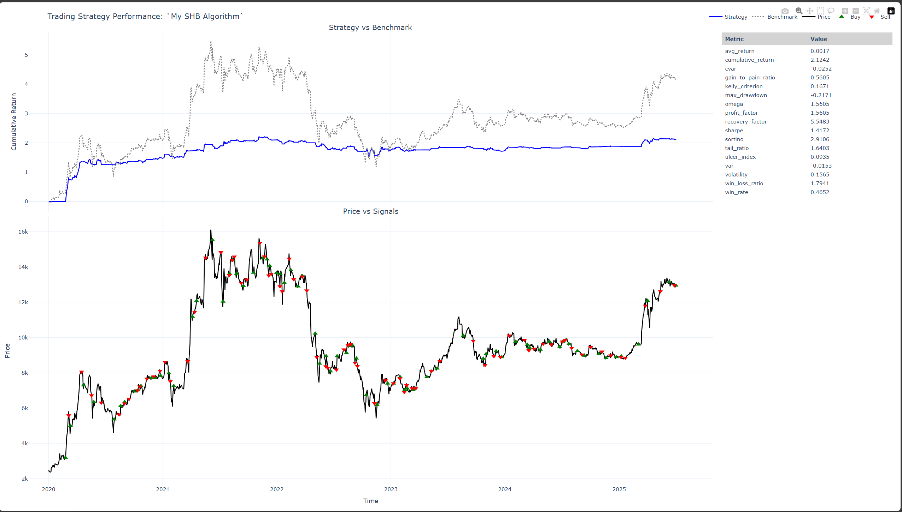

## Stock Strategy 1: Reversal Edge SHB

This strategy combines RSI with ADX to capture momentum reversals with strong trend confirmation on SHB stock.


```python
from xno.algo.st import StockAlgorithm

class ReversalEdgeStrategy(StockAlgorithm):
    def __setup__(self):
        self._name = "Reversal Edge SHB"
        self._ticker = "SHB"              # Saigon-Hanoi Bank
        self._resolution = "D"            # Daily timeframe
        self._from_time = "2020-01-01"   # 5.5 year backtest
        self._to_time = "2025-07-04"
        self._init_cash = 500_000_000    # 500M VND initial capital
        self._slippage = 0.05            # 5% slippage (realistic for VN market)

    def __algorithm__(self):
        # Technical indicators
        rsi = self._features.rsi()        # RSI with default 14 periods
        adx = self._features.adx()        # ADX for trend strength

        # Signal Logic: Buy when RSI is rising BUT trend strength is weakening
        # This catches momentum reversals before they become obvious
        buy_signal = (self.current(rsi) > self.previous(rsi)) & (self.current(adx) < self.previous(adx))
        
        # Sell when momentum fades and trend strengthens (potential reversal)
        sell_signal = (self.current(rsi) < self.previous(rsi)) & (self.current(adx) > self.previous(adx))

        self.buy(buy_signal, 1)   # Buy with full position
        self.sell(sell_signal, 1) # Sell full position

if __name__ == "__main__":
    algo = ReversalEdgeStrategy()
    algo.run()
    algo.visualize()  # Opens interactive chart in browser
    print("Algorithm run completed.")
```




