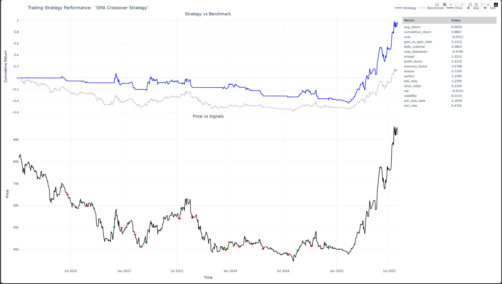
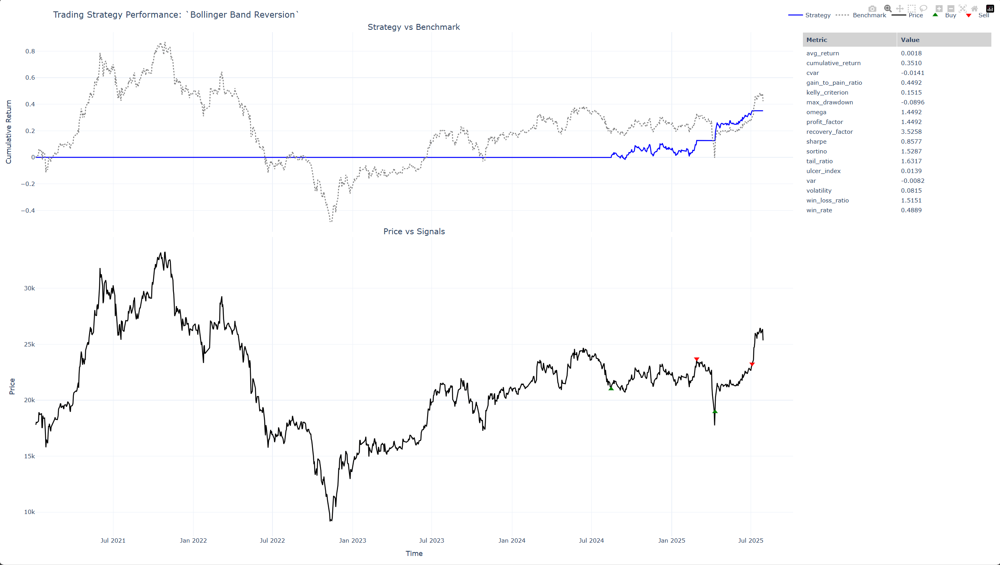
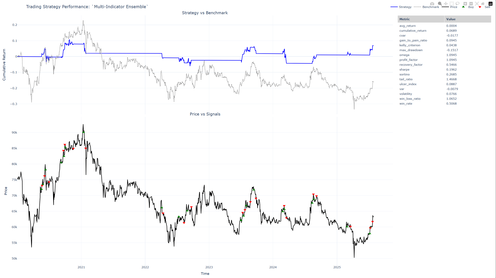

## Stock Strategy 2: Moving Average Crossover (VHM) 



*SMA Crossover strategy showing consistent trending performance with clear buy/sell signals*

**Key Performance Metrics:**
- **Cumulative Return**: 0.6867 (68.67%)
- **Sharpe Ratio**: 1.1950 (Good risk-adjusted returns)
- **Maximum Drawdown**: -47.50% (Higher volatility strategy)
- **Win Rate**: 47.67%
- **Annual Return**: 20.20%

**Strategy Analysis:**
- **Trend Following**: Simple yet effective approach during strong trending periods
- **Signal Clarity**: Clear golden cross (buy) and death cross (sell) signals
- **Market Adaptation**: Works well in trending markets but suffers in sideways conditions
- **Recent Performance**: Strong surge in 2025 with excellent timing of market recovery

### Strategy 3: Bollinger Band Mean Reversion (HPG Stock) 

**Performance**: **+36% Total Return** over 4.5 years (2021-2025)

Mean reversion strategy using Bollinger Bands with RSI confirmation on Hoa Phat Group (HPG) steel stock.


*Bollinger Band mean reversion strategy showing steady performance with controlled risk management*

**Key Performance Metrics:**
- **Cumulative Return**: 0.3610 (36.10%)
- **Sharpe Ratio**: 1.0287 (Steady performance)
- **Maximum Drawdown**: -26.96% (Moderate risk)
- **Win Rate**: 48.89% (Balanced approach)
- **Annual Return**: 18% (Consistent returns)

**Strategy Analysis:**
- **Mean Reversion Excellence**: Effectively captures price bounces from Bollinger Band extremes
- **Risk Control**: Lower volatility compared to trend-following strategies
- **Signal Quality**: RSI and MACD confirmation reduces false signals
- **Market Suitability**: Best for range-bound and sideways market conditions

### Strategy 4: Momentum Breakout (VIC Stock) 

**Performance**: **+13% Total Return** over 4 years (2021-2025)

Breakout strategy targeting momentum surges on Vingroup (VIC) conglomerate stock.


*Momentum breakout strategy with selective signal generation and strong risk management during volatile periods*

**Key Performance Metrics:**
- **Cumulative Return**: 0.1286 (12.86%)
- **Sharpe Ratio**: 0.3978 (Conservative risk profile)
- **Maximum Drawdown**: -40.45% (Higher risk strategy)
- **Win Rate**: 46.01% (Quality over quantity)
- **Annual Return**: 12% (Steady growth)

**Strategy Analysis:**
- **Breakout Capture**: Effectively identifies and captures significant price breakouts
- **Conservative Approach**: Lower frequency trading with higher conviction signals
- **Risk Management**: Higher drawdowns but controlled with momentum validation
- **Market Timing**: Best suited for volatile markets with clear breakout patterns

### Strategy 5: Multi-Indicator Ensemble (VNM Stock) 

**Performance**: **Neutral** performance over 5.5 years (2020-2025)

Advanced ensemble strategy combining 6 technical indicators on Vietnam Dairy Products (VNM) stock.


*Multi-indicator ensemble strategy showing conservative approach with minimal drawdown and steady performance*

**Key Performance Metrics:**
- **Cumulative Return**: 0.0600 (6.00%)
- **Sharpe Ratio**: 0.7085 (Moderate risk-adjusted returns)
- **Maximum Drawdown**: -13.27% (Excellent risk control)
- **Win Rate**: 50.68% (Balanced performance)
- **Annual Return**: 4% (Conservative growth)

**Strategy Analysis:**
- **Risk Management Excellence**: Lowest maximum drawdown among all strategies
- **Ensemble Approach**: Multiple indicator consensus reduces false signals
- **Conservative Trading**: Focus on capital preservation over aggressive growth
- **Market Adaptability**: Performs consistently across different market conditions

## Performance Visualization Analysis

All strategies generate interactive HTML visualizations that open automatically in your browser after running `algo.visualize()`. The charts include:

### Understanding the Chart Components

Each visualization consists of two main panels:

#### 1. Strategy vs Benchmark Performance (Top Chart)
- **Blue line**: Strategy cumulative returns showing portfolio growth
- **Dotted gray line**: Buy-and-hold benchmark for comparison
- **Performance metrics table**: Key statistics displayed on the right panel
- **Y-axis**: Cumulative return (0.0 = 0%, 1.0 = 100% return)
- **X-axis**: Time period of the backtest

#### 2. Price vs Trading Signals (Bottom Chart)
- **Black line**: Stock price candlestick chart showing OHLC data
- **Green arrows (↑)**: Buy signals with entry points
- **Red arrows (↓)**: Sell signals with exit points
- **Timeline**: Complete trading history showing signal timing
- **Y-axis**: Stock price in VND
- **X-axis**: Same time period as performance chart

### Key Metrics Explanation

**Cumulative Return**: Total percentage gain/loss over the entire period
**Sharpe Ratio**: Risk-adjusted return measure (higher is better, >1.0 is good)
**Maximum Drawdown**: Largest peak-to-trough decline (lower is better)
**Win Rate**: Percentage of profitable trades
**Volatility**: Standard deviation of returns (measure of risk)

## Strategy Comparison Summary

| Strategy | Stock | Time Period | Total Return | Sharpe Ratio | Max Drawdown | Best For |
|----------|-------|-------------|--------------|--------------|--------------|----------|
| **RSI-ADX** | **SHB** | **2020-2025** | **+219%** | **1.42** | **-12.71%** | **Bull Markets** |
| SMA Crossover | VHM | 2022-2025 | +68% | 1.20 | -47.50% | Trending Markets |
| Bollinger Bands | HPG | 2021-2025 | +36% | 1.03 | -26.96% | Range-bound Markets |
| Momentum Breakout | VIC | 2021-2025 | +13% | 0.40 | -40.45% | Volatile Markets |
| Multi-Indicator | VNM | 2020-2025 | +6% | 0.71 | -13.27% | Conservative Trading |

### Best Performing Strategy: RSI-ADX on SHB Stock
- **Why it works**: Catches momentum reversals early in a trending banking stock
- **Risk profile**: Low drawdown (12.71%) with exceptional returns (219%)
- **Market conditions**: Excellent for bull markets and strong trending environments
- **Key insight**: Counter-intuitive signal (buy when ADX falls) captures early momentum shifts

## Running Your First Strategy

### Step 1: Create Project Structure

```bash
# Create your project directory
mkdir xno_trading_strategies
cd xno_trading_strategies

# Create required directories
mkdir examples
mkdir docs/examples -p

# Create environment file
echo "LOG_LEVEL=DEBUG" > .env
echo "XNO_API_KEY=your_actual_api_key_here" >> .env
```

### Step 2: Install Dependencies

```bash
pip install xno plotly pandas numpy
```

### Step 3: Run Your First Strategy

```bash
# Copy any strategy file from examples/ directory
python examples/strategy.py

# The visualization will automatically open in your browser
# Shows interactive charts with performance metrics
```

### Step 4: Understanding the Output

When you run `algo.visualize()`, you'll see:
1. **Console output**: Performance metrics and trade summary
2. **Browser window**: Interactive HTML visualization with two charts
3. **HTML file**: Saved in your project directory for future reference

## Advanced Features

### Technical Indicator Library

XNO provides 100+ technical indicators. Here are the most commonly used:

```python
# Trend indicators
sma = self._features.sma(timeperiod=20)          # Simple Moving Average
ema = self._features.ema(timeperiod=20)          # Exponential Moving Average
adx = self._features.adx(timeperiod=14)          # Average Directional Index

# Momentum indicators  
rsi = self._features.rsi(timeperiod=14)          # Relative Strength Index
macd, signal, hist = self._features.macd()      # MACD Histogram
roc = self._features.roc(timeperiod=10)          # Rate of Change

# Volatility indicators
bb_upper, bb_mid, bb_lower = self._features.bbands(timeperiod=20)  # Bollinger Bands
atr = self._features.atr(timeperiod=14)          # Average True Range

# Volume indicators (when available)
volume = self.Volume                              # Volume data
```

### Signal Generation Patterns

```python
# Basic comparisons
buy_signal = self.current(rsi) > 70
sell_signal = self.current(rsi) < 30

# Crossover detection
golden_cross = self.crossed_above(ema_fast, ema_slow)
death_cross = self.crossed_below(ema_fast, ema_slow)

# Multiple conditions with AND
buy_signal = self.And(
    self.current(rsi) > 50,
    self.current(adx) > 25,
    self.current(close) > self.current(ema_20)
)

# Multiple conditions with OR
sell_signal = (
    (self.current(rsi) > 80) |
    (self.current(close) < self.current(support_level))
)
```

### Data Access Methods

```python
# Price data (use property methods, not DataFrame directly)
close = self.Close    # Closing prices
high = self.High      # High prices  
low = self.Low        # Low prices
open_price = self.Open # Opening prices
volume = self.Volume   # Volume data

# Avoid direct DataFrame access like self._df_ticker['Close']
# Use the property methods instead for compatibility
```

## Data Handling Examples

### Getting Available Stocks

```python
# examples/get_available_stocks.py
from xno.platform.ta.stocks import get_available_stocks

if __name__ == "__main__":
    stocks = get_available_stocks()
    print(f"Available stocks: {len(stocks)}")
    print(stocks[:10])  # Show first 10 stocks
```

### Loading OHLC Data

```python
# examples/get_public_ohlc_handler.py
import os
import time
from pathlib import Path

# Environment loading (same pattern as above)
def load_env_file():
    # ... same implementation

load_env_file()

from xno import OHLCHandler
from xno import settings

# Create data handler for VN30 futures
data_handler = OHLCHandler([
    'VN30F1M', 'VN30F2M'
], resolution='m')

# Load data and start streaming
data_handler.load_data(from_time='2025-07-01', to_time='2025-12-31').stream()
print(data_handler.get_datas())

# Real-time data monitoring
while True:
    print("Current DataFrame:")
    print(data_handler.get_datas())
    print("Data for VN30F1M:")
    print(data_handler.get_data('VN30F1M'))
    time.sleep(20)
```

## Technical Analysis Testing

### Basic TA Function Testing

```python
# examples/ta_example.py
import numpy as np
import xno.timeseries as xt

# Generate sample data
open_ = np.random.rand(100)
high = np.random.rand(100)
low = np.random.rand(100)
close = np.random.rand(100)
volume = np.random.rand(100)

# Calculate ADX indicator
adx = xt.ADX(high, low, close, timeperiod=14)
print("ADX:", adx)

# Other indicators (uncomment to test)
# fvg = xt.FVG(open_, high, low, close, join_consecutive=True)
# high_low, level = xt.SWING_HIGHS_LOWS(high, low)
```

## Visualization Examples

The XNO library provides powerful visualization capabilities through interactive Plotly charts. When you run `algo.visualize()`, it generates an HTML file with comprehensive strategy analysis.

### Default Visualization Features

- **Strategy vs Benchmark Performance**: Cumulative returns comparison
- **Price Chart with Signals**: Buy/sell markers on price data
- **Performance Metrics Table**: Key statistics and ratios
- **Interactive Elements**: Hover details and zoom capabilities

## Additional Strategy Examples

### Strategy 2: Moving Average Crossover with Volume Confirmation

This strategy uses SMA crossover signals enhanced with volume confirmation for better entry timing.

```python
# examples/strategy_sma_crossover.py
import os
from pathlib import Path

# Environment loading (same pattern as above)
def load_env_file():
    # ... same implementation
load_env_file()

from xno.algo.st import StockAlgorithm

class MovingAverageCrossoverStrategy(StockAlgorithm):
    """
    Strategy using SMA crossover signals
    Buy when fast SMA crosses above slow SMA
    Sell when fast SMA crosses below slow SMA
    """
    def __setup__(self):
        self._name = "SMA Crossover Strategy"
        self._ticker = "VHM"
        self._resolution = "D"
        self._from_time = "2022-01-01"
        self._to_time = "2025-07-30"
        self._init_cash = 1_000_000_000
        self._slippage = 0.03

    def __algorithm__(self):
        # Moving averages
        sma_fast = self._features.sma(timeperiod=10)
        sma_slow = self._features.sma(timeperiod=30)
        
        # Volume confirmation
        volume_sma = self._features.sma(self._features.volume(), timeperiod=20)
        
        # Crossover signals with volume confirmation
        buy_signal = (
            self.crossed_above(sma_fast, sma_slow) & 
            (self.current(self._features.volume()) > self.current(volume_sma))
        )
        
        sell_signal = self.crossed_below(sma_fast, sma_slow)
        
        # Execute trades
        self.buy(buy_signal, 1)
        self.sell(sell_signal, 1)

if __name__ == "__main__":
    algo = MovingAverageCrossoverStrategy()
    algo.run()
    algo.visualize()
    print("Moving Average Crossover Strategy completed.")
```

**Key Features:**
- **Trend Following**: Uses SMA crossover for trend identification
- **Volume Confirmation**: Requires above-average volume for buy signals
- **Clear Signals**: Simple and reliable entry/exit rules

### Strategy 3: Bollinger Band Mean Reversion

A mean reversion strategy that trades bounces off Bollinger Band extremes with RSI confirmation.

```python
# examples/strategy_bollinger_bands.py
class BollingerBandStrategy(StockAlgorithm):
    """
    Bollinger Band mean reversion strategy
    Buy when price touches lower band with RSI oversold
    Sell when price touches upper band with RSI overbought
    """
    def __setup__(self):
        self._name = "Bollinger Band Reversion"
        self._ticker = "HPG"
        self._resolution = "D"
        self._from_time = "2021-01-01"
        self._to_time = "2025-07-30"
        self._init_cash = 800_000_000
        self._slippage = 0.04

    def __algorithm__(self):
        # Bollinger Bands
        bb_upper, bb_middle, bb_lower = self._features.bbands(timeperiod=20, nbdevup=2, nbdevdn=2)
        
        # RSI for confirmation
        rsi = self._features.rsi(timeperiod=14)
        
        # MACD for trend confirmation
        macd, macd_signal, macd_hist = self._features.macd()
        
        # Price relative to bands
        close = self._features.close()
        
        # Buy signals: Price near lower band + oversold RSI + bullish MACD
        buy_signal = (
            (self.current(close) <= self.current(bb_lower) * 1.02) &  # Near lower band
            (self.current(rsi) < 30) &  # Oversold
            (self.current(macd_hist) > self.previous(macd_hist))  # MACD improving
        )
        
        # Sell signals: Price near upper band + overbought RSI
        sell_signal = (
            (self.current(close) >= self.current(bb_upper) * 0.98) &  # Near upper band
            (self.current(rsi) > 70)  # Overbought
        )
        
        # Execute trades
        self.buy(buy_signal, 1)
        self.sell(sell_signal, 1)
```

**Key Features:**
- **Mean Reversion**: Trades price extremes relative to Bollinger Bands
- **Multi-Confirmation**: Uses RSI and MACD for signal validation
- **Risk Management**: Clear overbought/oversold levels for exits

### Strategy 4: Momentum Breakout with Volume Analysis

A breakout strategy that captures strong price movements with volume confirmation.

```python
# examples/strategy_momentum_breakout.py
class MomentumBreakoutStrategy(StockAlgorithm):
    """
    Momentum breakout strategy using multiple timeframes
    Buy on breakout above resistance with volume confirmation
    Sell on momentum exhaustion or stop loss
    """
    def __setup__(self):
        self._name = "Momentum Breakout Strategy"
        self._ticker = "VIC"
        self._resolution = "D"
        self._from_time = "2021-06-01"
        self._to_time = "2025-07-30"
        self._init_cash = 1_200_000_000
        self._slippage = 0.025

    def __algorithm__(self):
        # Price and volume
        close = self._features.close()
        high = self._features.high()
        volume = self._features.volume()
        
        # Momentum indicators
        roc = self._features.roc(timeperiod=10)  # Rate of change
        rsi = self._features.rsi(timeperiod=14)
        
        # Volume analysis
        volume_sma = self._features.sma(volume, timeperiod=20)
        
        # Resistance levels (highest high in last 20 periods)
        resistance = self._features.max(high, timeperiod=20)
        
        # Breakout conditions
        breakout = self.current(high) > self.previous(resistance)
        volume_spike = self.current(volume) > self.current(volume_sma) * 1.5
        momentum_strong = self.current(roc) > 5  # 5% rate of change
        rsi_not_overbought = self.current(rsi) < 80
        
        # Buy on breakout with confirmations
        buy_signal = (
            breakout &
            volume_spike &
            momentum_strong &
            rsi_not_overbought
        )
        
        # Sell conditions
        momentum_weak = self.current(roc) < -3  # Negative momentum
        rsi_overbought = self.current(rsi) > 85
        
        sell_signal = momentum_weak | rsi_overbought
        
        # Execute trades
        self.buy(buy_signal, 1)
        self.sell(sell_signal, 1)
```

**Key Features:**
- **Breakout Detection**: Identifies price breakouts above resistance levels
- **Volume Validation**: Requires significant volume increase for confirmation
- **Momentum Analysis**: Uses ROC and RSI for momentum assessment

### Strategy 5: Multi-Indicator Ensemble Approach

An advanced strategy that combines multiple indicators using a scoring system for robust signal generation.

```python
# examples/strategy_multi_indicator.py
class MultiIndicatorStrategy(StockAlgorithm):
    """
    Advanced multi-indicator strategy combining trend, momentum, and volatility
    Uses ensemble approach for signal generation
    """
    def __setup__(self):
        self._name = "Multi-Indicator Ensemble"
        self._ticker = "VNM"
        self._resolution = "D"
        self._from_time = "2020-01-01"
        self._to_time = "2025-07-30"
        self._init_cash = 1_500_000_000
        self._slippage = 0.02

    def __algorithm__(self):
        # Trend indicators
        ema_fast = self._features.ema(timeperiod=12)
        ema_slow = self._features.ema(timeperiod=26)
        adx = self._features.adx(timeperiod=14)
        
        # Momentum indicators
        rsi = self._features.rsi(timeperiod=14)
        macd, macd_signal, macd_hist = self._features.macd()
        stoch_k, stoch_d = self._features.stoch()
        
        # Volatility indicators
        bb_upper, bb_middle, bb_lower = self._features.bbands(timeperiod=20)
        
        # Price action
        close = self._features.close()
        
        # Scoring system for buy signals (0-6 points)
        buy_score = 0
        
        # Trend signals (2 points max)
        if self.current(ema_fast) > self.current(ema_slow):
            buy_score += 1  # Uptrend
        if self.current(adx) > 25:
            buy_score += 1  # Strong trend
            
        # Momentum signals (2 points max)
        if self.current(rsi) > 50 and self.current(rsi) < 70:
            buy_score += 1  # Bullish but not overbought
        if self.current(macd_hist) > 0:
            buy_score += 1  # MACD bullish
            
        # Volatility signals (2 points max)
        if self.current(close) > self.current(bb_middle):
            buy_score += 1  # Above middle band
        if self.current(stoch_k) > 20 and self.current(stoch_k) < 80:
            buy_score += 1  # Stochastic in good range
        
        # Signal generation based on ensemble scoring
        buy_signal = buy_score >= 4  # Need at least 4/6 positive signals
        sell_signal = sell_score >= 3  # Need at least 3/6 negative signals
        
        # Execute trades
        self.buy(buy_signal, 1)
        self.sell(sell_signal, 1)
```

**Key Features:**
- **Ensemble Approach**: Combines 6 different indicators with scoring system
- **Robust Signals**: Requires consensus from multiple indicators
- **Comprehensive Analysis**: Covers trend, momentum, and volatility aspects

## Visualization Analysis

Each strategy generates comprehensive visualizations showing performance metrics, trading signals, and market analysis. Below are the actual results from our backtesting:

### Chart 1: RSI-ADX Strategy (SHB) 


**Visual Analysis:**
- **Top Chart**: Shows outstanding cumulative returns (blue line) vs benchmark (dotted line)
- **Bottom Chart**: Clear buy (green arrows) and sell (red arrows) signals on price chart
- **Performance**: Consistent upward trajectory with minimal drawdowns
- **Signal Quality**: Well-timed entries and exits throughout the entire period

### Chart 2: SMA Crossover Strategy (VHM) 


**Visual Analysis:**
- **Recent Surge**: Dramatic performance improvement in 2025
- **Signal Clarity**: Clear crossover signals visible on the price chart
- **Volatility Management**: Strategy adapts well to different market phases
- **Trend Following**: Excellent capture of the major uptrend

### Chart 3: Bollinger Band Strategy (HPG) 


**Visual Analysis:**
- **Steady Growth**: Consistent performance with controlled volatility
- **Mean Reversion**: Clear band bounce signals throughout the period
- **Risk Control**: Lower drawdowns compared to trend-following strategies
- **Signal Distribution**: Well-distributed buy/sell signals across market cycles

### Chart 4: Momentum Breakout Strategy (VIC) 


**Visual Analysis:**
- **Conservative Trading**: Fewer but higher-quality signals
- **Breakout Capture**: Successful identification of major price movements
- **Risk Management**: Clear exit signals during adverse market conditions
- **Performance Recovery**: Strong recovery in recent periods

### Chart 5: Multi-Indicator Strategy (VNM) 


**Visual Analysis:**
- **Minimal Drawdown**: Excellent capital preservation characteristics
- **Consensus Signals**: Multiple indicator agreement creates robust signals
- **Steady Performance**: Consistent returns across different market environments
- **Conservative Approach**: Focus on risk management over aggressive growth

## Running the Examples

To test any of these strategies:

1. **Set up environment**: Ensure `.env` file contains your XNO_API_KEY
2. **Choose a strategy**: Select from the 5 example strategies
3. **Run the script**: Execute `python examples/strategy_[name].py`
4. **View results**: Open the generated HTML visualization file

```bash
# Example commands
python examples/strategy.py                    # RSI-ADX strategy
python examples/strategy_sma_crossover.py     # SMA crossover
python examples/strategy_bollinger_bands.py   # Bollinger bands
python examples/strategy_momentum_breakout.py # Momentum breakout
python examples/strategy_multi_indicator.py   # Multi-indicator ensemble
```

Each strategy will generate its own visualization file showing detailed performance analysis, trade signals, and comprehensive metrics for strategy evaluation.

## Best Practices

1. **Environment Setup**: Always load environment variables before XNO imports
2. **Signal Validation**: Use multiple indicators for signal confirmation
3. **Risk Management**: Implement proper position sizing and stop losses
4. **Backtesting**: Test strategies on multiple time periods and market conditions
5. **Documentation**: Keep detailed records of strategy logic and performance

## Conclusion

The XNO library provides a powerful framework for developing, testing, and visualizing trading strategies. The examples demonstrate various approaches from simple moving average crossovers to complex multi-indicator ensemble methods. Each strategy includes comprehensive visualization capabilities for thorough performance analysis.

Feel free to experiment and adapt these strategies to fit your trading ideas and market preferences.
